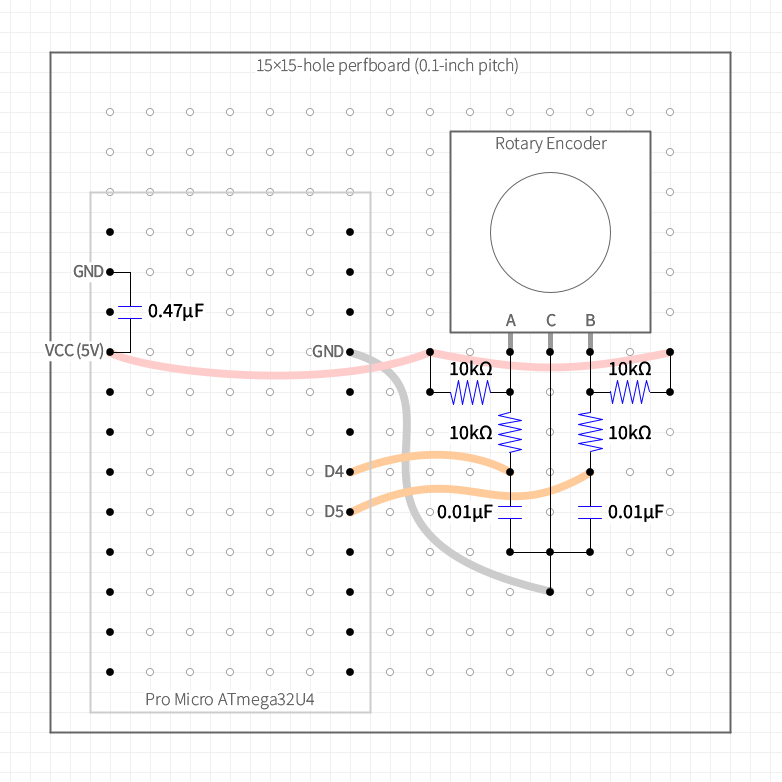
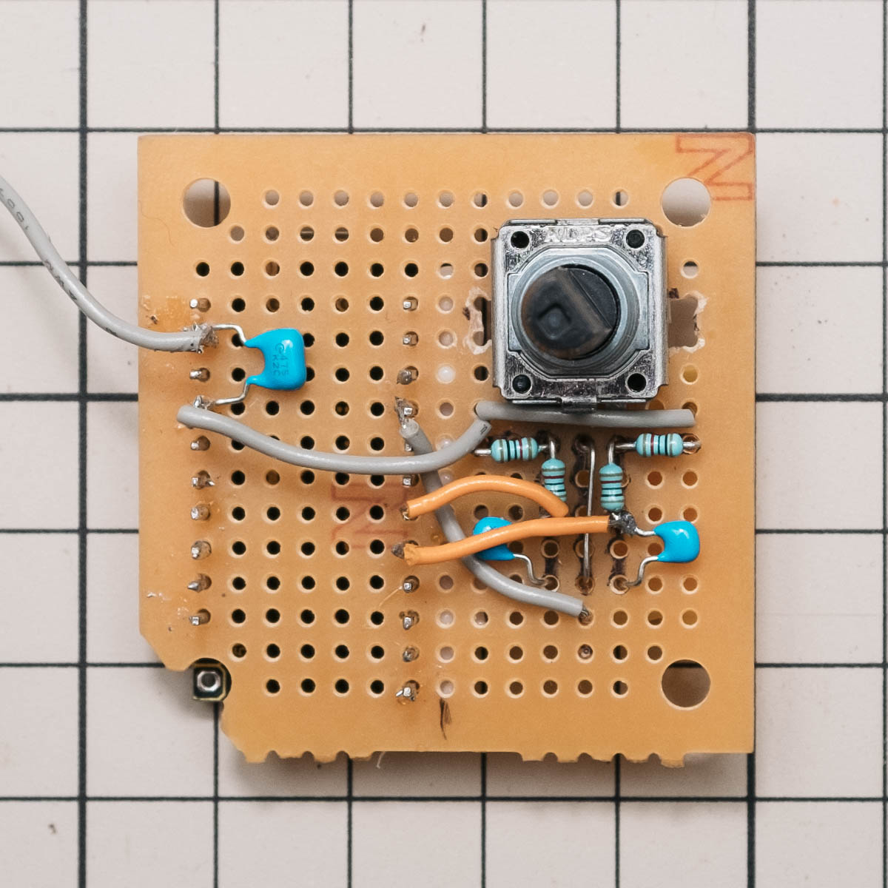
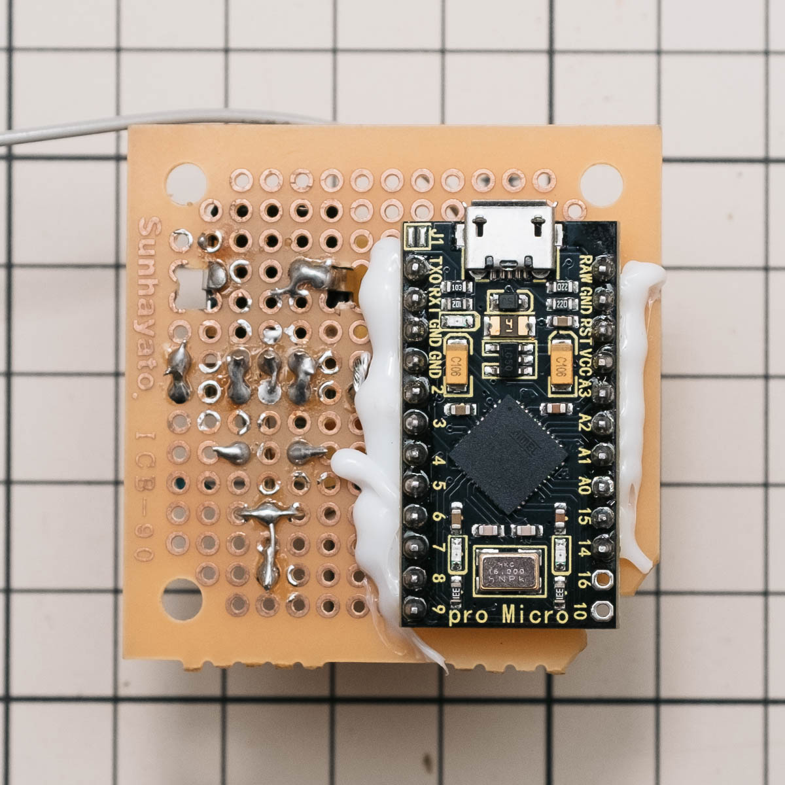
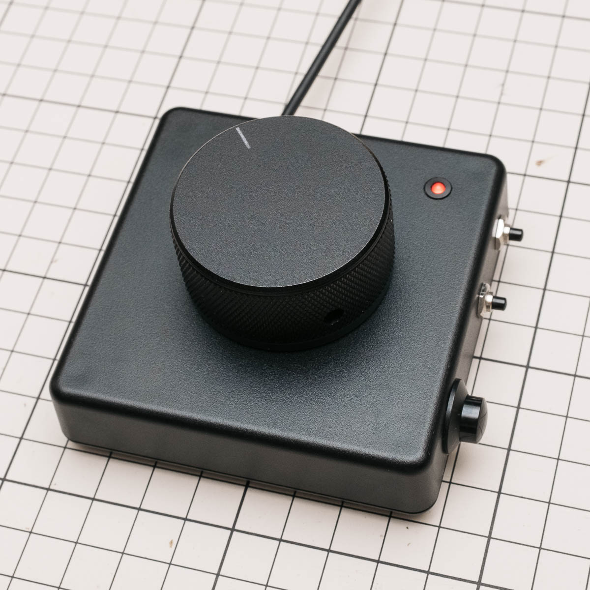

# USB-MIDI Encoder and Switch (ATmega32U4 / Pro Micro) 🎛️

🌍 **Languages**: **日本語** | [English](README.md)

**ロータリーエンコーダ×1／複数スイッチ対応の USB-MIDI コントローラ用ファームウェア。**

- **対応MCU/ボード**：ATmega32U4（例：**Pro Micro 16 MHz / 5 V**）  
- **エンコーダ出力仕様**：**相対 MIDI CC（Binary Offset 64±1）**

⬇️ **ダウンロード**: [usb_midi_encoder_switch.ino — latest][ino-latest]

---

## ✨ 構成と特徴
- **エンコーダ**：2相 A/B（**クリック / ノンクリック両対応**）
- **スイッチ**：一般的なモーメンタリスイッチ（**ノーマルオープン：NO**）
- **LED**（PWM 3/5/6/9/10）  
  - 指定スイッチの**内部ラッチ状態（押すたび ON⇄OFF）**を表示  
    — **内部ラッチ表示により、DAW のトグル（例：リファレンスの Solo など）を画面を見ずに把握できます。**
  - **MIDI 送信時に短く点灯するパルスに対応（任意）**
- **エンコーダの操作感**
  - **低速は微調整しやすい**（積分デバウンス＋休止→休止のフルサイクルゲーティング）
  - **中〜高速ではしっかり進む**（デテント間隔ベースの加速テーブル＋出力ペーシング）
- **堅牢性**：ピン重複・LED非PWM・配列設定ミスなどを **`static_assert`** で**ビルド時検出**

---

## ハードウェア

### 推奨部品（例）
- **エンコーダ（ノンクリック）**：ALPS Alpine **EC12E2430803**（2相A/B）  
  **ノブ径 30 mm 以上推奨（目安 35–40 mm）**
  —— *EC12E2430803 は回転トルクがやや重めのため*
- **スイッチ**：モーメンタリ（NO）
- **プルアップ抵抗**：A/B 各相 **10 kΩ**（5 Vへ）
- **入力フィルタ（RC）**：A/B 各相 **10 kΩ + 0.01 µF（ノード→GND）**
- **LED**：3 mm（任意色）＋直列抵抗 **220–1 kΩ**（PWM ピンへ）
- **デカップリング**：**0.47 µF（VCC–GND）**

### 回路例（推奨：外付けプルアップ + RC フィルタ）  
  
*エンコーダ部の実体配線図。スイッチ、LED配線は省略。*

### 対応ピン
- **デジタル入力**：**D0–D10, D14–D16, D18–D21**
- **PWM（LED）**：**3 / 5 / 6 / 9 / 10**
 

*Pro Micro (ATmega32U4) のピン配置 — デジタル I/O のみ（アナログ／通信省略）*

---

## 実装例（BOM：一例）
- Pro Micro 5 V（ATmega32U4）×1  
- ユニバーサル基板：サンハヤト ICB-90GH ×1（半分使用）  
- ケース：タカチ TW8-2-8 ×1  
- ロータリーエンコーダ：ALPS **EC12E2430803**（ノンクリック）×1  
- 3 mm 赤色 LED：OSR5JA3Z74A ×1（＋ブラケット）  
- モーメンタリスイッチ：MS-402-K ×2、MS-350M-1 ×1  
- 抵抗 10 kΩ ×4 ／ コンデンサ 0.01 µF ×2 ／ デカップリング 0.47 µF ×1  
- 2.54 mm ピンヘッダ、AWG28 配線材、熱収縮チューブ、ホットメルト


_エンコーダ部の実装例（表・スイッチ・LED省略）_


_エンコーダ部の実装例（裏・スイッチ・LED省略）_


_完成例（外観）_

---

## 🚀 クイックスタート
1. **配線**  
   - エンコーダ **A/B → 任意のデジタルピン**（上の回路推奨）  
   - LED → **PWM ピン（3/5/6/9/10）**  
   - スイッチ → 任意のデジタルピン（片側 GND、**モーメンタリ NO**、**入力は内蔵プルアップ固定**）
2. **設定（ユーザー調整エリア）**  
   - `encoderPinA / encoderPinB / ledPin`、`SWITCHES[]` の `pin/cc` を実機に合わせて編集  
   - **無反応**なら `REST_POLICY` を **Hard00or11 ↔ Hard01or10** で切替  
   - **方向が逆**なら `ENCODER_INVERT` を切替  
   - **プルアップ（エンコーダ入力のみ）**：外付けを使うなら `USE_INTERNAL_PULLUP=false`（二重回路を避ける）。※スイッチは常に `INPUT_PULLUP`。
3. **Arduino IDE でビルド / 書き込み** 
   - ボード：**Arduino Leonardo**（ATmega32U4）
   - ライブラリマネージャで「MIDIUSB」をインストール

---

## ⚙️ 設定（ユーザー調整エリアだけ触ればOK）

主要項目（抜粋）：
```cpp
// 休止位相（無反応なら切替）
enum class RestPolicy : uint8_t { Hard00or11, Hard01or10 };
constexpr RestPolicy REST_POLICY = RestPolicy::Hard00or11;

// 配線／極性
constexpr bool USE_INTERNAL_PULLUP = false; // 外付けプルアップ（PU）を使うなら false
constexpr bool ENCODER_INVERT      = true;  // 逆に感じたら切替

// ピン例
constexpr int encoderPinA = 4;              // 任意のデジタル
constexpr int encoderPinB = 5;
constexpr int ledPin      = 9;              // PWM（3/5/6/9/10）

// スイッチとCC（{pin, cc} を追加するだけで拡張可）
struct SwitchCfg { int pin; byte cc; };
constexpr SwitchCfg SWITCHES[] = { {18,21}, {19,22}, {20,23} };

// MIDI
constexpr uint8_t midiChannel = 1;          // 1..16
constexpr byte    encoderCC   = 10;         // 0..119

// エンコーダの加速（デテント間隔ベース）
constexpr unsigned long DETENT_THRESHOLDS_MS[] = {30,38,48,60,75,95,120,170};
constexpr byte          DETENT_STEPS[]         = {13,10,8,7,5,3,2,1};
constexpr bool          FULL_CYCLE_GATING      = true;

// 出力ペーシング
constexpr unsigned long OUTPUT_TICK_MS = 2;
constexpr byte          MAX_PER_TICK   = 3;
```

### ⚡ フィーリング調整（目安）
- **中速で進みが足りない**：`DETENT_THRESHOLDS_MS` を**下げる**／`DETENT_STEPS` を**上げる**
- **速回しで追従しない**：`OUTPUT_TICK_MS` を**下げる**（1–2 ms）／`MAX_PER_TICK` を**上げる**（2–4）
- **低速がガタつく**：`FULL_CYCLE_GATING` を**true**に設定／`INTEGR_MAX` を**上げる**／`REST_DEBOUNCE_MS` を**上げる**
- **低速の即時性を抑えたい（滑らかにしたい）**：`IMMEDIATE_OUTPUT_THRESHOLD_MS` を**上げる**（例：32→38–42 ms）

### 💡 LED の動作
```cpp
// 指定スイッチの内部ラッチを表示（0始まり、-1で無効）
constexpr int8_t LED_FOLLOWS_SWITCH_INDEX = 0;

// 明るさ（0..255）
constexpr byte   LED_BRIGHTNESS_ON  = 32; // ベース点灯の明るさ

// 送信パルス（MIDI 送信時だけ一瞬点灯）
constexpr bool          LED_ACTIVITY_PULSE   = false; // 使うなら true
constexpr byte          LED_PULSE_BRIGHTNESS = 64; // パルス時の明るさ
constexpr unsigned long LED_PULSE_MS         = 60;
```
- **明るさ**：`LED_BRIGHTNESS_ON` で **0..255** の範囲。

---

## 仕様：MIDI 出力
- **エンコーダ（相対 CC：Binary Offset 64±1）**  
  - 送出形式：**CC#`encoderCC` / Ch.`midiChannel`**。**±1** を必要回数だけ**連続送出**して合計変化量を表します。

<details>
<summary>低レイヤ詳細（必要な方のみ）</summary>

- Binary Offset の符号値は **+1 = `0x41`**, **−1 = `0x3F`**。
- 加速時はこれらを連続送出して相対量を表現します。
</details>

- **スイッチ（トグル CC）**  
  - 各スイッチに CC（`SWITCHES[]` で指定）を割り当て、**ON=127 / OFF=0** を送出。（**リリースでトグル**）

---

## 依存ライブラリ
- **MIDIUSB**（`<MIDIUSB.h>`）— Arduino公式の「MIDIUSB」ライブラリ（Leonardo/32U4対応）

---
## トラブルシューティング
- **DAW で相対 CC として動作しない**：**DAW 側**のノブ/エンコーダ設定を **Relative / Binary Offset** に設定。  
- **方向が逆**：`ENCODER_INVERT` を `false` ↔ `true` に切り替え。
- **無反応 / 半分しか反応しない**：`REST_POLICY` を **Hard00or11 ↔ Hard01or10** で切替／ピンのアサインが正しいか見直し
- **低速がガタつく**：`INTEGR_MAX` を上げる／`REST_DEBOUNCE_MS` を上げる  
- **進みが足りない**：`DETENT_STEPS` を上げる／`DETENT_THRESHOLDS_MS` を下げる／`OUTPUT_TICK_MS` を下げる／`MAX_PER_TICK` を上げる  
- **LEDが点かない**：LEDピンが **PWM（3/5/6/9/10）** か、直列抵抗の有無を確認

---

## 設定早見表（ミニ）
- `midiChannel` — 1..16
- `encoderCC` — 0..119
- `SWITCHES[]` — `{ pin, cc }`
- `encoderPinA`, `encoderPinB`
- `ledPin` — PWM（3/5/6/9/10）
- `LED_FOLLOWS_SWITCH_INDEX` — −1=無効
- `LED_BRIGHTNESS_ON` — 0..255（ベース点灯の明るさ）
- `LED_PULSE_BRIGHTNESS` — 0..255（パルス時の明るさ）
- `REST_POLICY` — Hard00or11 / Hard01or10
- `IMMEDIATE_OUTPUT_THRESHOLD_MS` — 低速の即時出力しきい値（ms）

---

## ライセンス
このプロジェクトは [MIT License](LICENSE) で配布します。

---

## 変更履歴
- **v1.0.0** 初版：フルサイクルゲーティング／デテント間隔ベース加速／出力ペーシング／ビルド時チェック／RC推奨回路／LED連動＆パルス対応／BOM掲載

[ino-latest]: https://github.com/m43d4k/usb-midi-encoder-switch/releases/latest/download/usb_midi_encoder_switch.ino