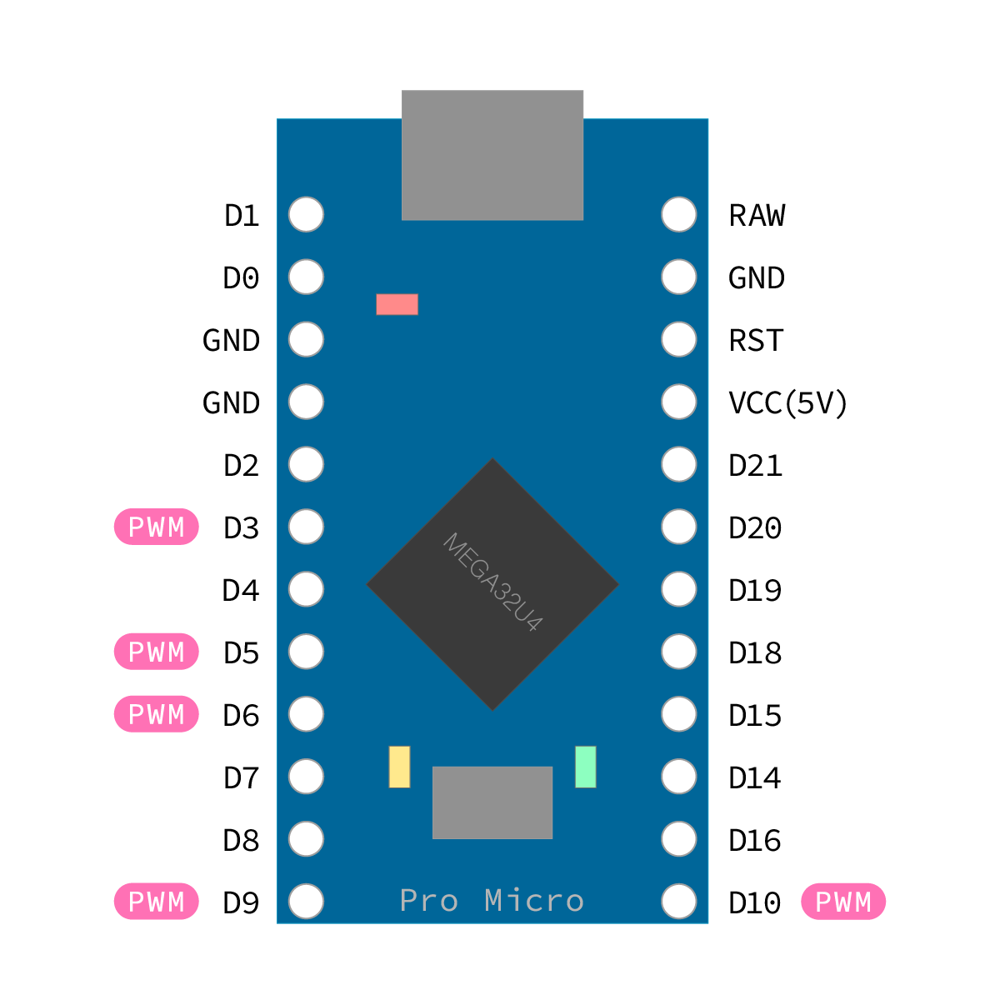

# USB-MIDI Encoder and Switch (ATmega32U4 / Pro Micro) 🎛️

🌍 **Languages**: **English** | [日本語](README-ja.md)

**Firmware for a compact USB-MIDI controller: one rotary encoder + multiple switches.**

- **MCU/Board**: ATmega32U4 (e.g., **Pro Micro 16 MHz / 5 V**)  
- **Encoder output**: **Relative MIDI CC (Binary Offset 64±1)**

⬇️ **Download**: [usb_midi_encoder_switch.ino — latest][ino-latest]

---

## ✨ Features
- **Encoder**: 2-phase A/B (**with or without detents**)
- **Switches**: momentary switches (**normally open: NO**)
- **LED** (PWM 3/5/6/9/10)  
  - Mirrors a selected switch’s **internal latch** (ON⇄OFF on each press)  
  — **lets you see toggle states in your DAW (e.g., reference track Solo) without looking at the screen.**
  - **Optional transmit pulse: lights briefly on MIDI send (encoder/switch)**
- **Encoder feel**
  - **Fine control at low speed** (integrating debounce + full-cycle gating between rest states)
  - **Solid advance at mid/high speed** (speed-sensitive acceleration + paced output)
- **Robustness**: build-time checks via `static_assert` (pin conflicts, non-PWM LED pins, array config mistakes)

---

## Hardware

### Recommended parts (examples)
- **Encoder (no detent)**: ALPS Alpine **EC12E2430803** (2-phase A/B)  
  **Knob ≥ 30 mm recommended (35–40 mm typical)** — *EC12E2430803 is relatively high-torque*
- **Switches**: momentary (NO)
- **Pull-ups**: **10 kΩ** on A/B to 5 V
- **Input RC filter**: **10 kΩ + 0.01 µF** (node → GND) per A/B
- **LED**: 3 mm (any color) + series resistor **220–1 kΩ** to a PWM pin
- **Decoupling**: **0.47 µF (VCC–GND)**

### Example wiring (recommended: external pull-ups + RC)


_Encoder section wiring diagram. Switch & LED wiring omitted._

### Pins
- **Digital I/O**: **D0–D10, D14–D16, D18–D21**
- **PWM (LED)**: **3 / 5 / 6 / 9 / 10**



*Pinout — Pro Micro (ATmega32U4), digital I/O only (analog/comms omitted)*

---

## Example BOM
- Pro Micro 5 V (ATmega32U4) ×1  
- Universal board: Sunhayato ICB-90GH ×1 (half used)  
- Enclosure: Takachi TW8-2-8 ×1  
- Rotary encoder: ALPS **EC12E2430803** (no detent) ×1  
- 3 mm red LED: OSR5JA3Z74A ×1 (with bezel)  
- Momentary switches: MS-402-K ×2, MS-350M-1 ×1  
- Resistors 10 kΩ ×4 / Capacitors 0.01 µF ×2 / Decoupling 0.47 µF ×1  
- 2.54 mm pin headers, AWG28 wire, heat-shrink, hot-melt glue


_Encoder section, assembly example (front; switches/LED omitted)_


_Encoder section, assembly example (back; switches/LED omitted)_

---

## 🚀 Quick Start
1. **Wiring**  
   - Encoder **A/B → any digital pins** (use the RC wiring above)  
   - LED → **PWM pin (3/5/6/9/10)**  
   - Switches → any digital pins (**NO to GND**, **internal pull-up is fixed**)
2. **Setup (user-tunable area)**  
   - Edit `encoderPinA / encoderPinB / ledPin` and `SWITCHES[] { pin, cc }` to match your wiring  
   - **No movement?** Toggle `REST_POLICY` between **Hard00or11 ↔ Hard01or10**  
   - **Reversed direction?** Toggle `ENCODER_INVERT`  
   - **Pull-ups (encoder inputs only)**: if you use external pull-ups, set `USE_INTERNAL_PULLUP=false` (avoid double pull-ups). *Switch inputs always use `INPUT_PULLUP`.*
3. **Build / Upload (Arduino IDE)**  
   - Board: **Arduino Leonardo** (ATmega32U4)  
   - Install **“MIDIUSB”** via Library Manager

---

## ⚙️ Only edit the user-tunable area
Key items (excerpt):
```cpp
// Rest phase (toggle if no movement)
enum class RestPolicy : uint8_t { Hard00or11, Hard01or10 };
constexpr RestPolicy REST_POLICY = RestPolicy::Hard00or11;

// Wiring / polarity
constexpr bool USE_INTERNAL_PULLUP = false; // If you use external pull-ups, keep this false
constexpr bool ENCODER_INVERT      = true;  // Flip if direction feels reversed

// Pins (example)
constexpr int encoderPinA = 4;              // any digital pin
constexpr int encoderPinB = 5;
constexpr int ledPin      = 9;              // PWM (3/5/6/9/10)

// Switches and CC ({pin, cc}; extend by adding entries)
struct SwitchCfg { int pin; byte cc; };
constexpr SwitchCfg SWITCHES[] = { {18,21}, {19,22}, {20,23} };

// MIDI
constexpr uint8_t midiChannel = 1;          // 1..16
constexpr byte    encoderCC   = 10;         // 0..119

// Encoder acceleration (detent interval based)
constexpr unsigned long DETENT_THRESHOLDS_MS[] = {30,38,48,60,75,95,120,170};
constexpr byte          DETENT_STEPS[]         = {13,10,8,7,5,3,2,1};
constexpr bool          FULL_CYCLE_GATING      = true;

// Output pacing
constexpr unsigned long OUTPUT_TICK_MS = 2;
constexpr byte          MAX_PER_TICK   = 3;
```

### ⚡ Feel tuning (quick hints)
- **Not enough advance at mid speeds**: **lower** `DETENT_THRESHOLDS_MS` / **raise** `DETENT_STEPS`  
- **Can’t keep up at very fast turns**: **lower** `OUTPUT_TICK_MS` (1–2 ms) / **raise** `MAX_PER_TICK` (2–4)  
- **Chatter at very low speeds**: set `FULL_CYCLE_GATING` to **true** / **raise** `INTEGR_MAX` / **raise** `REST_DEBOUNCE_MS`  
- **Reduce responsiveness at low speeds (for smoother feel)**: **raise** `IMMEDIATE_OUTPUT_THRESHOLD_MS` (e.g., **32→38–42 ms**)

### 💡 LED behavior
```cpp
// Follow the internal latch of a specific switch (0-based, -1 to disable)
constexpr int8_t LED_FOLLOWS_SWITCH_INDEX = 0;

// Brightness (0..255)
constexpr byte   LED_BRIGHTNESS_ON  = 32; // Base ON brightness

// Optional transmit pulse: lights briefly on MIDI send (encoder/switch)
constexpr bool          LED_ACTIVITY_PULSE   = false; // set true to enable
constexpr byte          LED_PULSE_BRIGHTNESS = 64;    // Pulse brightness
constexpr unsigned long LED_PULSE_MS         = 60;
```
- **Brightness**: adjust **`LED_BRIGHTNESS_ON`** in the 0..255 range.

---

## Spec: MIDI Output
- **Encoder (Relative CC: Binary Offset 64±1)**  
  - Sends **CC#`encoderCC` / Ch.`midiChannel`**. Emits **±1** repeatedly to represent the total change.

<details>
<summary>Low-level details (for reference)</summary>

- Binary Offset value codes: **+1 = `0x41`**, **−1 = `0x3F`**.  
- With acceleration, these are sent repeatedly to express the relative delta.
</details>

- **Switches (toggle CC)**  
  - For each switch (`SWITCHES[]`), sends **ON=127 / OFF=0**. (**toggles on release**)

---

## Dependencies
- **MIDIUSB** (`<MIDIUSB.h>`) — Official Arduino “MIDIUSB” library (Leonardo/ATmega32U4 supported)

---

## Troubleshooting
- **DAW doesn’t recognize it as relative CC**: set the **DAW-side** knob/encoder mode to **Relative / Binary Offset**.  
- **Direction reversed**: toggle `ENCODER_INVERT` true/false.  
- **No movement / only half the states detected**: toggle `REST_POLICY` (Hard00or11 ↔ Hard01or10) / recheck pin assignments  
- **Chatter at low speeds**: raise `INTEGR_MAX` / raise `REST_DEBOUNCE_MS`  
- **Not enough advance**: raise `DETENT_STEPS` / lower `DETENT_THRESHOLDS_MS` / lower `OUTPUT_TICK_MS` / raise `MAX_PER_TICK`  
- **LED won’t light**: ensure the LED pin is **PWM (3/5/6/9/10)** and a series resistor is present

---

## Quick reference
- `midiChannel` — 1..16
- `encoderCC` — 0..119
- `SWITCHES[]` — `{ pin, cc }`
- `encoderPinA`, `encoderPinB`
- `ledPin` — PWM (3/5/6/9/10)
- `LED_FOLLOWS_SWITCH_INDEX` — −1 = disabled
- `LED_BRIGHTNESS_ON` — 0..255 (base ON brightness)
- `LED_PULSE_BRIGHTNESS` — 0..255 (pulse brightness)
- `REST_POLICY` — Hard00or11 / Hard01or10
- `IMMEDIATE_OUTPUT_THRESHOLD_MS` — threshold for immediate low-speed output (ms)

---

## License
This project is distributed under the [MIT License](LICENSE).

---

## Changelog
- **v1.0.0** Initial release: full-cycle gating / detent-interval acceleration / output pacing / build-time asserts / RC recommended wiring / LED follow & pulse / BOM

[ino-latest]: https://github.com/m43d4k/usb-midi-encoder-switch/releases/latest/download/usb_midi_encoder_switch.ino